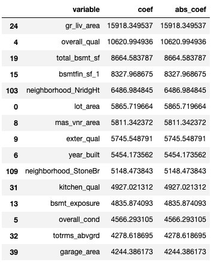
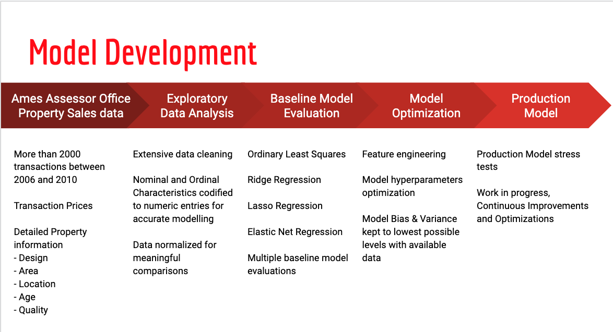

# Problem Statement
The Ames Assessor’s Office has collected information of property details and sales prices for transactions made between 2006 to 2010.

The purpose of this study is to build a repeatable model for Ames' property price prediction with the lowest possible bias and variance.

This model can be used by Ames city home buyers and sellers to guide their property valuations.

# Executive Summary
- Ames Assessor’s Office dataset contains 2051 property transactions price/details
- Average property price between 2006 and 2010 was $181K with a std of $79K
    - Average price has remain stable throughout this period
- Quality related characteristics
    - Overall house quality has to most significant impact on property price
    - Buyers are willing to pay extra premium for better quality kitchens
    - Other quality aspect related to basement, garage, heating, fireplace will also influence property price although to a lesser extent.
- Size related characteristics
    - Bigger properties will definitely have a higher price. However not every size charateristic will have same influence on the final price.
    - Buyers put more considerations on the more basic ground and first floor living spaces.
- Location related characteristics
    - Floating villages and lower densities area (exclusivity) commands higher price
    - Property within parks, green belts have higher prices than those closer
 to railways and major roads
- Age related characteristics
    - Among the various subclasses, newer property commands higher price.
    - Budget conscious buyers may consider properties built before 1990 where prices are less influence by property age
- Model Prediction
    - Multiple features linear regression with and without regularization were explored
    - Regression with Ridge regularization was selected to be our baseline models
    - An optimized C production model was produced after dropping outlier points and colinear features. R2 score of 0.926, MAE score of $15K, RMSE of $21.5K<br>


# Methodology


# Project Directory Structure
```
project-2
|__ code
|   |__ 01_1_EDA_Null_Cleaning.ipynb.ipynb   
|   |__ 01_2_EDA_Outliers_Cleaning.ipynb
|   |__ 01_3_EDA_Categorical_data.ipynb
|   |__ 01_4_EDA_Pairplots_Heatmaps.ipynb
|   |__ 02_Preprocessing_and_Feature_Engineering.ipynb
|   |__ 03_Model_Benchmarks.ipynb
|   |__ 04_Model_Tuning.ipynb
|__ datasets
|   |__ Input Data
|   |   /__ train.csv
|   |   /__ test.csv
|   |__ Output Data
|   |   /__ train_noNull.csv
|   |   /__ test_noNull.csv
|   |   /__ train_noNullnoOut.csv
|   |   /__ test_noNullnoOut.csv
|   |   /__ train_noNullnoOutAllNum.csv
|   |   /__ train_Prepro.csv
|   |   /__ test_Prepro.csv
|   |   /__ ridge_BL.csv
|   |   /__ ridge_opti_c.csv
|__ Pictures
|   |__ methodology.png
|__ Ames Housing Price Model.pdf
|__ README.md
```

# Data
- Ames property transaction price and info (../datasets/input Data/train.csv)

### Data Dictionary
|Column|Type|Description|Distribution|Correlation to Sale Price|Null Handling %|Outlier Handling %%|Feature Handling|
|---|---|---|---|---|---|---|---|
|Id|int|Property Id|random|None|||exclude from model features|
|pid|int|Parcel identification number|con't, nominal|None|||exclude from model features|
|ms_subclass|int|Identifies the type of dwelling involved in the sale|nominal|Higher price for newer|||dummified|
|ms_zoning|object|Identifies the general zoning classification of the sale|nominal|Higher price for some zones|||dummified|
|lot_frontage|float|Linear feet of street connected to property|con't, Normal|+ve|insufficient domain knowledge to conduct null imputation||exclude from model features|
|lot_area|int|Lot size in square feet|con't, right skewed|+ve||||
|street|object|Type of road access to property|nominal|higher price for paved||2pts>100K sqft KIV|dummified|
|alley|object|Type of alley access to property|nominal|higher price for paved|insufficient domain knowledge to conduct null imputation||exclude from model features|
|lot_shape|object|General shape of property|ordinal|none|||map to numeric|
|land_contour|object|Flatness of the property|nominal|Higher price for some cat|||dummified|
|utilities|object|Type of utilities available|ordinal|Higher price for some cat|||map to numeric|
|lot_config|object|Lot configuration|nominal|None|||dummified|
|land_slope|object|Slope of property|ordinal|None|||map to numeric|
|neighborhood|object|Physical locations within Ames city limits|nominal|Higher prices for some cat|||dummified|
|condition_1|object|Proximity to various conditions|nominal|Higher prices for some cat|||dummified|
|condition_2|object|Proximity to various conditions (if more than one is present)|nominal|Higher prices for some cat|||dummified|
|bldg_type|object|Type of dwelling|nominal|Higher prices for some cat|||dummified|
|house_style|object|Style of dwelling|nominal|Higher prices for some cat|||dummified|
|overall_qual|int|Rates the overall material and finish of the house|discrete, ordinal|+ve||||
|overall_cond|int|Rates the overall condition of the house|discrete, ordinal|weak +ve||||
|year_built|int|Original construction date|discrete, left skewed|+ve||||
|year_remod/add|int|Remodel date (same as construction date if no remodeling or additions)|discrete, left/right skewed|+ve||||
|roof_style|object|Type of roof|nominal|Higher prices for some cat|||dummified|
|roof_matl|object|Roof material|nominal|Higher prices for some cat|||dummified|
|exterior_1st|object|Exterior covering on house|nominal|Higher prices for some cat|||dummified|
|exterior_2nd|object|Exterior covering on house (if more than one material)|nominal|Higher prices for some cat|||dummified|
|mas_vnr_type|object|Masonry veneer type|nominal|Higher prices for some cat|Null to None||dummified|
|mas_vnr_area|float|Masonry veneer area in square feet|con't, many Zeros for none|+ve|Null to 0|||
|exter_qual|object|Evaluates the quality of the material on the exterior|ordinal|Higher prices for some cat|||map to numeric|
|exter_cond|object|Evaluates the present condition of the material on the exterior|ordinal|Higher prices for some cat|||map to numeric|
|foundation|object|Type of foundation|nominal|Higher prices for some cat|||dummified|
|bsmt_qual|object|Evaluates the height of the basement|ordinal|Higher prices for some cat|Null to NA||map to numeric|
|bsmt_cond|object|Evaluates the general condition of the basement|ordinal|Higher prices for some cat|Null to NA||map to numeric|
|bsmt_exposure|object|Refers to walkout or garden level walls|ordinal|Higher prices for some cat|Null to NA||map to numeric|
|bsmtfin_type_1|object|Rating of basement finished area|ordinal|Higher prices for some cat|Null to NA||map to numeric|
|bsmtfin_sf_1|float, int|Type 1 finished square feet|con't, many Zeros for none|+ve|Null to 0|2pts>12K sqft KIV||
|bsmtfin_type_2|object|Rating of basement finished area (if multiple types)|ordinal|Higher prices for some cat|Null to NA||map to numeric|
|bsmtfin_sf_2|float, int|Type 2 finished square feet|con't, many Zeros for none|weak +ve|Null to 0|2pts>1200 sqft KIV||
|bsmt_unf_sf|float, int|Unfinished square feet of basement area|con't, right skewed|weak +ve|Null to 0|||
|total_bsmt_sf|float, int|Total square feet of basement area|con't, normal|+ve|Null to 0|2pts>4K sqft KIV||
|heating|object|Type of heating|nominal|Higher prices for some cat|||dummified|
|heating_qc|object|Heating quality and condition|ordinal|Higher prices for some cat|||map to numeric|
|central_air|object|Central air conditioning|nominal|Higher prices for some cat|||dummified|
|electrical|object|Electrical system|ordinal|Higher prices for some cat|delete Null row||map to numeric|
|1st_flr_sf|int|First Floor square feet|con't, normal|+ve||2pts>4K sqft KIV||
|2nd_flr_sf|int|Second floor square feet|con't, many zeros|+ve||||
|low_qual_fin_sf|int|Low quality finished square feet (all floors)|con't, many zeros|weak +ve||||
|gr_liv_area|int|Above grade (ground) living area square feet|con't, normal|+ve||2pts>5K sqft KIV||
|bsmt_full_bath|float, int|Basement full bathrooms|discrete, ordinal|Higher prices for some cat|Null to 0|||
|bsmt_half_bath|float, int|Basement half bathrooms|discrete, ordinal|Higher prices for some cat|Null to 0|||
|full_bath|int|Full bathrooms above grade|discrete, ordinal|Higher prices for some cat||||
|half_bath|int|Half baths above grade|discrete, ordinal|Higher prices for some cat||||
|bedroom_abvgr|int|Bedrooms above grade (does NOT include basement bedrooms)|discrete, ordinal|Higher prices for some cat||||
|kitchen_abvgr|int|Kitchens above grade|discrete, ordinal|Higher prices for some cat||||
|kitchen_qual|object|Kitchen quality|ordinal|Higher prices for some cat|||map to numeric|
|totrms_abvgrd|int|Total rooms above grade (does not include bathrooms)|discrete, ordinal|Higher prices for some cat||||
|functional|object|Home functionality (Assume typical unless deductions are warranted)|ordinal|Higher prices for some cat|||map to numeric|
|fireplaces|int|Number of fireplaces|discrete, ordinal|Higher prices for some cat||||
|fireplace_qu|object|Fireplace quality|ordinal|Higher prices for some cat|Null to NA||map to numeric|
|garage_type|object|Garage location|nominal|Higher prices for some cat|Null to NA||dummified|
|garage_yr_blt|float|Year garage was built|discrete, ordinal|Higher prices for some cat|Null to 0|delete pt=2207||
|garage_finish|object|Interior finish of the garage|ordinal|Higher prices for some cat|Null to NA||map to numeric|
|garage_cars|float, int|Size of garage in car capacity|discrete, ordinal|Higher prices for some cat|Null to 0|||
|garage_area|float, int|Size of garage in square feet|con't, normal|+ve|Null to 0|||
|garage_qual|object|Garage quality|ordinal|Higher prices for some cat|Null to NA||map to numeric|
|garage_cond|object|Garage condition|ordinal|Higher prices for some cat|Null to NA||map to numeric|
|paved_drive|object|Paved driveway|ordinal|Higher prices for some cat|||map to numeric|
|wood_deck_sf|int|Wood deck area in square feet|con't, normal|+ve||1pt>1400 sqft KIV||
|open_porch_sf|int|Open porch area in square feet|con't, normal|+ve||||
|enclosed_porch|int|Enclosed porch area in square feet|con't, normal|+ve||||
|3ssn_porch|int|Three season porch area in square feet|con't, normal|weak +ve||||
|screen_porch|int|Screen porch area in square feet|con't, normal|weak +ve||||
|pool_area|int|Pool area in square feet|con't, many zeros|weak +ve||||
|pool_qc|object|Pool quality|ordinal|Higher prices for some cat|Null to NA||map to numeric|
|fence|object|Fence quality|ordinal|Higher prices for some cat|Null to NA||map to numeric|
|misc_feature|object|Miscellaneous feature not covered in other categories|nominal|Higher prices for some cat|Null to NA||dummified|
|misc_val|int|$Value of miscellaneous feature|con't, many zeros|weak +ve||||
|mo_sold|int|Month Sold (MM)|discrete, uniform|||||
|yr_sold|int|Year Sold (YYYY)|discrete, uniform|||||
|sale_type|object|Type of sale|nominal|Higher prices for some cat|||dummified|
|saleprice|int|Sale price $$|con't, normal|||||

% Blank indicates no null values<br>
%% Blank indicates no outliers values

# Conclusion
- An Ames housing price production model was developed with R-sqrt score: 0.90 , MAE $15K (8.2% of average house price) and RMSE $21K (12% of average)
- Model tested on unseen target data and return similar RMSE scores of approximately $27K
- Property quality and size has the highest leverage on transaction price
- Moving forward
    - There are many more collinear features that can be omitted from the optimized C model. However at the time of project submission, this was not fully explored yet.
    - This model is also limited to the city of Ames between 2006 and 2010. Applying this model to other cities and time frame is unlikely to yield accurate results. Nevertheless, the same model development flow may be applied to a different context.

# Kaggle
- Linear Regression with Ridge Regularization was our best baseline model. It was use to predict the ridge_BL results
- Further optimization to model was use to predict ridge_opti_c results


